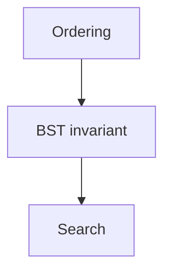

---
aliases:
  - BST basics
learn-topic: "Binary search trees"
rating: 4
learn-status: active
learn-created: 2026-09-20
learn-updated: 2026-09-20T10:30
learn-sessions:
  - "2026-09-20 10:00 · 11111111"
tags:
  - cs
cssclasses:
  - wide
---
## Session 1 (2026-09-20)
%% learn-session: 11111111-2222-3333-4444-555555555555 %%

> [!quote] YOU

Teach me binary search trees

> [!abstract] PI

Plan:

> [!question] Quiz
> What does the BST invariant say about the left subtree?
>
> 1. All keys are smaller
> 2. All keys are larger

> [!success] Quiz — correct ✓
> Your answer: 1. All keys are smaller
> Correct answer: 1

MY OWN NOTE: I wrote this myself between sessions. Keep it!
