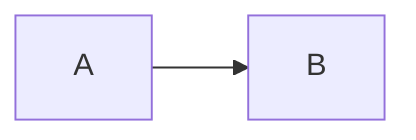

# Negative check

No `cssclasses: pi-learn` here, so the snippet does not apply and anything
Obsidian does not center by default shows up as a centering offender.

- valid cross-note heading: [[render-check#Some heading]]
- broken cross-note heading: [[render-check#Absent heading]]
- broken same-note heading: [[#Nope]]
- missing embed: ![[missing-diagram.png|500]]

> [!note] Short
> Tiny callout.

$$
a^2 + b^2 = c^2
$$
