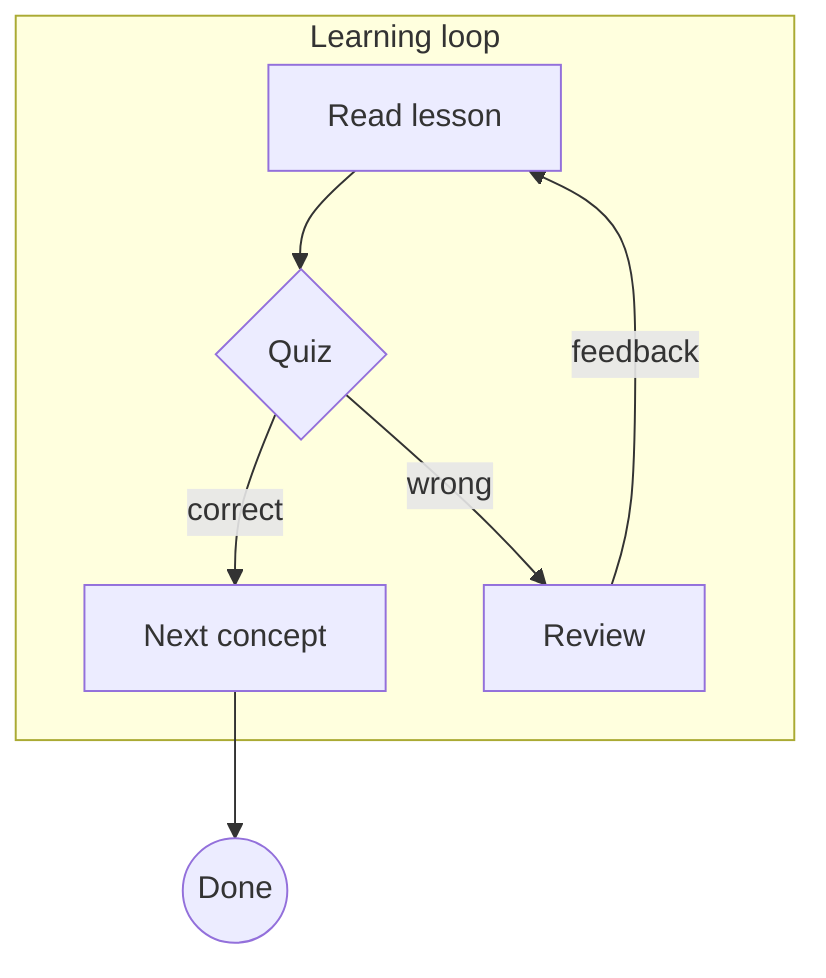
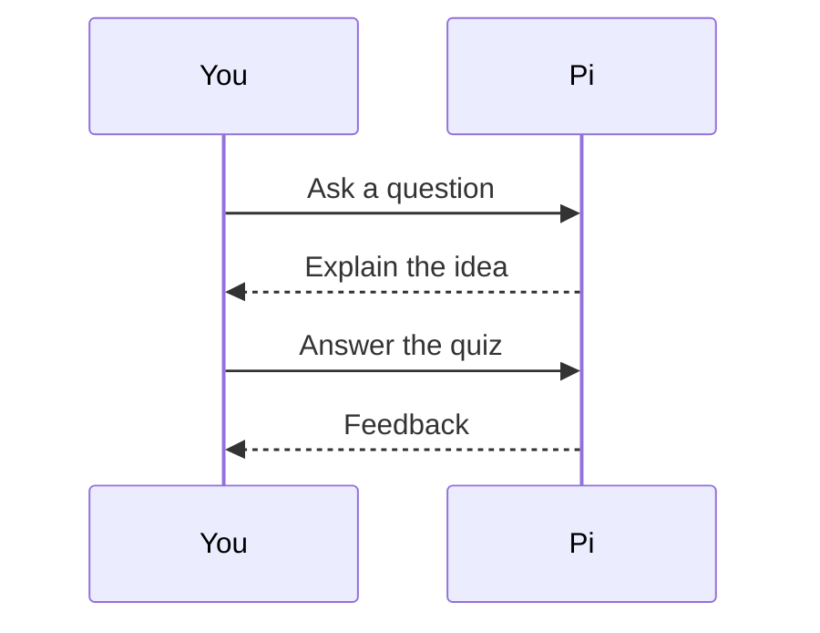
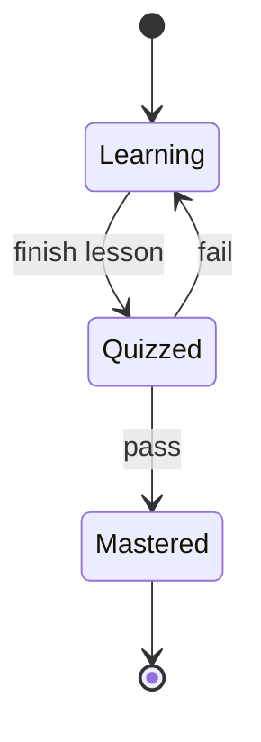

# Render check

This fixture exercises everything pi-learn writes into Obsidian. The verifier
must report **4 rendered diagrams, 1 Mermaid error and 1 unresolved link**.

%% hidden comment: this must not appear in reading view %%

## Some heading

Jump back here with [[#Some heading]]. This link is broken on purpose: [[Missing note]].

## Valid diagrams







## Broken diagram

```mermaid
flowchart TD
    A[Foo (bar)] --> B
```

## Callouts

> [!quote] YOU
> Why does the square grow faster than the number?

> [!abstract] PI
> Squaring multiplies a number by itself, so the growth compounds.

> [!question] Quiz
> What is $x^2$ when $x = 3$?
>
> 1. 6
> 2. 9
> 3. 12
>
> ```mermaid
> flowchart LR
>     Q[x = 3] --> S[x squared]
>     S --> R[9]
> ```

> [!success] Correct
> $3^2 = 9$, because squaring means
>
> $$
> x^2 = x \cdot x
> $$

> [!failure] Not quite
> $3 \times 2 = 6$ is doubling, not squaring.

> [!warning] Watch out
> Do not confuse $2x$ with $x^2$.

Display math:

$$
\sum_{k=1}^{n} k = \frac{n(n+1)}{2}
$$
